# FlowLab

> 부동산 매물 예약금 결제 · 실시간 1:1 채팅 · 영상 스트리밍을 **MVI 단방향 상태 흐름**으로 구현한 iOS 앱

<br>

## 📅 개발 기간

- **2025.12.15 ~ 2026.02.07** (약 8주)
- 개발 인원: 1인 (iOS)

<br>

## 📌 개요

- **한 줄 소개**: 사용자 입력, 서버 응답, 결제 SDK 콜백, 소켓 수신이 한 화면의 상태를 동시에 바꾸는 예약 · 미디어 앱
- **구현 목표**: 상태 변경 진입점을 `Intent` 하나로 모아, 화면 값이 어디서 바뀌었는지 추적 가능한 구조
- **탭 구성**

| 탭 | 주요 화면 |
| --- | --- |
| 홈 | 배너 · 인기 매물 · 오늘의 토픽, 매물 상세 → 예약금 결제, 출석 체크 웹뷰 |
| 비디오 | 영상 목록 · 상세, 화질 변경 · 전체 화면 재생 |
| 채팅 | 채팅방 목록, 친구 목록 → 1:1 채팅방 |
| 내 정보 | 로그아웃 |

<br>

## 🛠 개발 환경

| 항목 | 내용 |
| --- | --- |
| Minimum Target | iOS 17.0 |
| Device | iPhone |
| IDE | Xcode 26.1 |
| Language | Swift 5 |
| Dependency Manager | Swift Package Manager |

<br>

## ✨ 주요 기능

- **MVI 패턴 및 화면 전환 로직**
  - `Intent → Store → State / SideEffect` 단방향 흐름
  - `AppRouter` + 탭별 `TabRouter`로 화면 전환 책임 분리
- **로그인 인증 및 토큰 만료 동시성 로직**
  - `actor` 기반 갱신 Task 공유 → 동시 만료 시 재발급 1회
  - 세션 만료 시 앱 전역 화면 스택 초기화
- **실시간 1:1 채팅**
  - Realm 로컬 우선 표시 + 커서 기반 증분 동기화
  - Socket.IO 실시간 수신, `chatId` 기준 중복 제거
- **Iamport 활용 PG 결제 및 서버 영수증 검증**
  - 주문번호 선발급 → PG 결제 → 서버 검증 성공 시에만 예약 확정
- **웹뷰 기반 출석 체크 기능**
  - `WKScriptMessageHandler` 기반 웹 ↔ 앱 양방향 메시지 브릿지

<br>

## 🧰 기술 스택

| 분류 | 기술 |
| --- | --- |
| UI | SwiftUI, Observation(`@Observable`), UIKit(`UIViewControllerRepresentable`) |
| Architecture | MVI (Intent · State · SideEffect), Router, Repository, DIContainer |
| Concurrency | Swift Concurrency (`async/await`, `actor`, `async let`, `AsyncStream`), Combine |
| Network | URLSession 기반 `ApiClient` · `Endpoint` · `Interceptor` |
| Realtime | Socket.IO |
| Local Storage | Realm (채팅 메시지), Keychain (토큰 · userId · FCM 토큰) |
| Payment | iamport-ios 1.4.7 (KG이니시스 테스트 PG) |
| Web | WKWebView, WKScriptMessageHandler |
| Media | AVKit, AVFoundation |
| Image | Kingfisher 8.6.2 |
| Push | Firebase Cloud Messaging 12.6.0 |

<br>

## 🔍 주요 기능 상세

### 1. MVI 패턴 및 화면 전환 로직

#### 1-1. 단방향 데이터 흐름

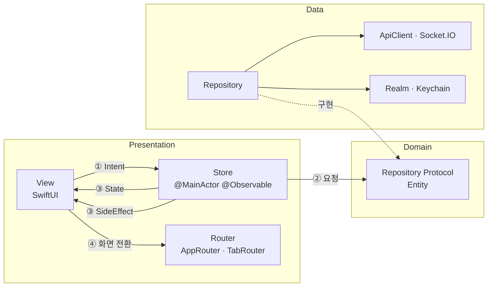

- `StoreProtocol`로 모든 화면 Store 형태 통일
  - `State`: 화면이 그리는 지속 값 (로딩 · 목록 · 예약 여부 등)
  - `Intent`: 화면이 보낼 수 있는 요청 목록, `action(_:)` 단일 진입점
  - `SideEffect`: 알림 · 결제창 표시 · 화면 이동 등 1회성 이벤트
- `private(set) var state` → View는 읽기만 가능, 상태 변경은 Store 내부에서만 발생
- SideEffect는 `PassthroughSubject`로 방출 → View가 `.onReceive`로 1회 처리
  - State에 남기지 않아 화면 재구성 시 중복 실행 방지
- Repository 프로토콜 + `DIContainer` 생성자 주입 → Store의 구체 타입 의존 제거

```swift
protocol StoreProtocol {
    associatedtype State
    associatedtype Intent
    associatedtype SideEffect

    var state: State { get }
    var effect: AnyPublisher<SideEffect, Never> { get }
    func action(_ intent: Intent)
}
```

#### 1-2. Router 구조

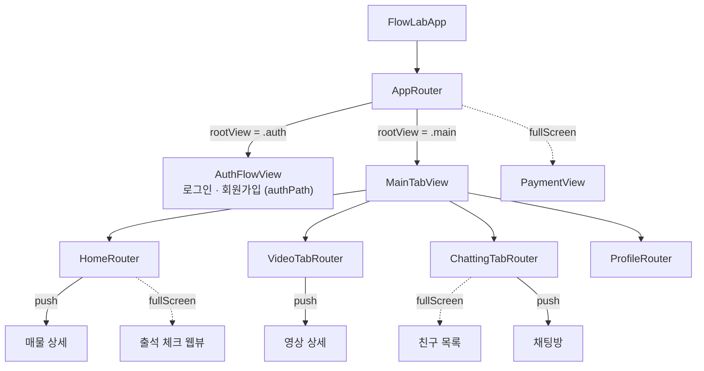

- **AppRouter**: 앱 전역 전환 담당
  - 루트 전환 (`auth` ↔ `main`), 인증 플로우 `NavigationPath`, 결제 fullScreen, 탭 선택
  - 세션 만료 시 전역 화면 초기화 ([2-4](#2-4-세션-만료-전역-처리) 참고)
- **TabRouter** (Home · Video · Chatting · Profile): 탭별 독립 `NavigationPath` 보유
  - `RouterProtocol` 기본 구현으로 `push` · `pop` · `popToRoot` 공통화
  - `ViewBuildable.buildView(for:)`로 Route → View 생성, DIContainer 팩토리 사용

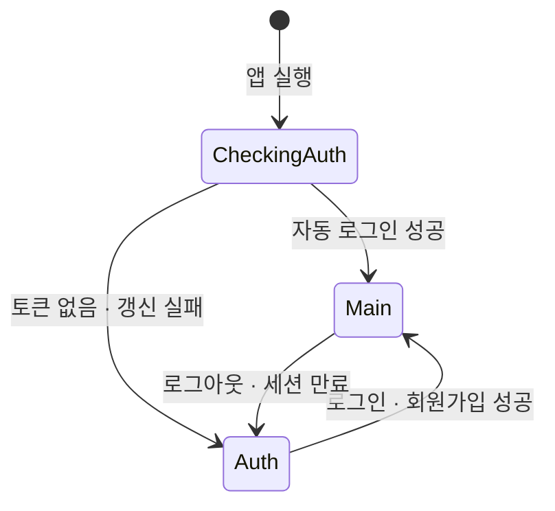

- 자동 로그인 확인 동안 `ProgressView` 표시 → 결과에 따라 루트 화면 결정

#### 1-3. 모달 dismiss 후 push (채팅방 진입)

- 친구 목록(fullScreen)에서 채팅방(push)으로 이어지는 연속 전환
- dismiss와 push를 동시에 실행하지 않도록 목적지를 `pendingRoute`에 보관 → `onDismiss` 시점에 push

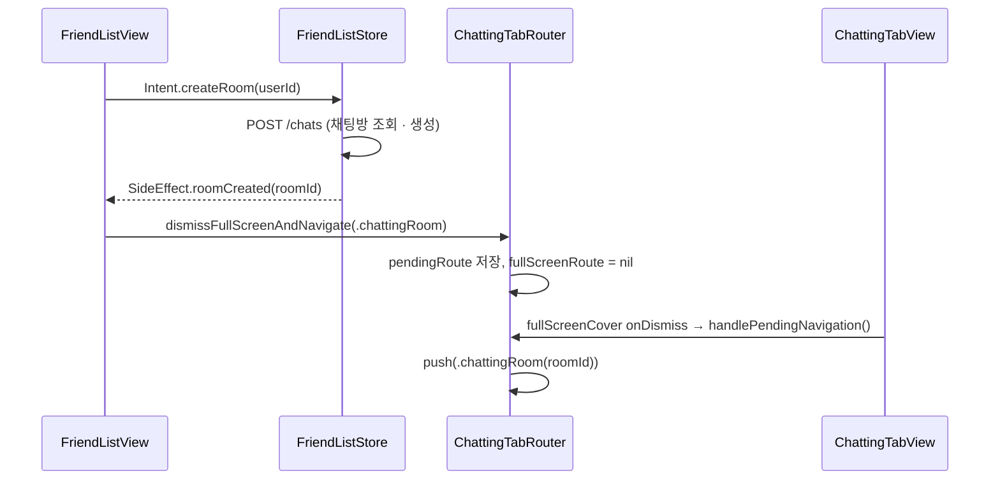

<br>

### 2. 로그인 인증 및 토큰 만료 동시성 로직

#### 2-1. 로그인 · 자동 로그인

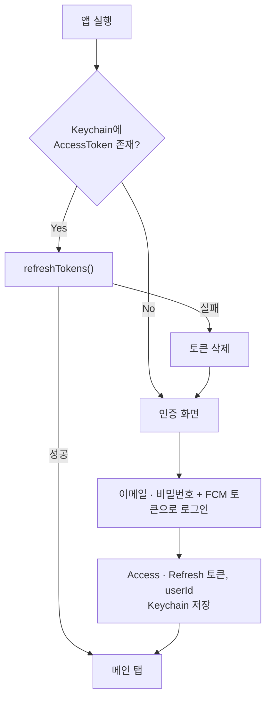

- 로그인 요청에 FCM 디바이스 토큰 포함 (푸시 수신용)
- 토큰 · userId는 Keychain 저장
- 앱 실행 시 토큰 갱신으로 세션 유효성 확인 후 루트 화면 결정

#### 2-2. Interceptor 기반 인증 · 재시도

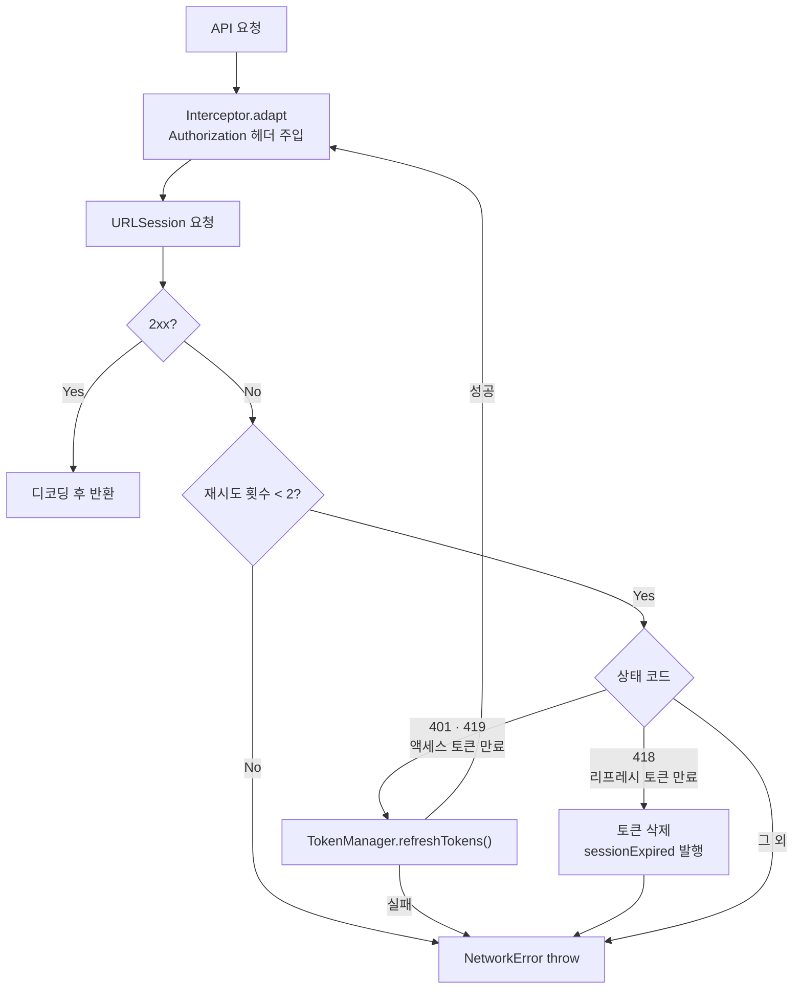

- `adapt`: `requiresAuth` 엔드포인트에만 `Authorization` 헤더 주입
- `retry`: 상태 코드별 갱신 · 세션 만료 · 에러 전달 분기
- 재시도 최대 2회 → 무한 재시도 방지
- 토큰 갱신 전용 `ApiClient`는 Interceptor 미적용 → 갱신 요청이 다시 갱신을 유발하는 순환 차단

#### 2-3. 동시 토큰 만료 — 갱신 Task 공유

- **문제**: 홈 화면은 API 4개를 `async let`으로 동시 호출 → 토큰 만료 시 요청마다 개별 갱신 시도 → 중복 재발급 · 토큰 덮어쓰기 위험
- **해결**: `TokenManager`를 `actor`로 구현, 진행 중인 갱신 `Task` 보관
  - 진행 중 Task 있음 → 새 요청 없이 기존 Task 결과 대기
  - 없음 → Task 생성 · 저장 후 1회 실행, 완료 시 `defer`로 해제
  - Task 확인 ~ 저장 사이 `await` 없음 → actor 재진입 상황에서도 중복 생성 불가
- **결과**: N개 요청 동시 만료 → 재발급 API 1회 호출, 모든 요청이 새 토큰으로 재시도

```swift
func refreshTokens() async throws -> Bool {
    if let existingTask = refreshTask {      // 진행 중인 갱신이 있으면 결과만 대기
        return try await existingTask.value
    }

    let task = Task<Bool, Error> {
        defer { self.refreshTask = nil }
        return try await performRefreshToken()
    }

    self.refreshTask = task                  // 새 Task가 재발급 1회 실행
    return try await task.value
}
```

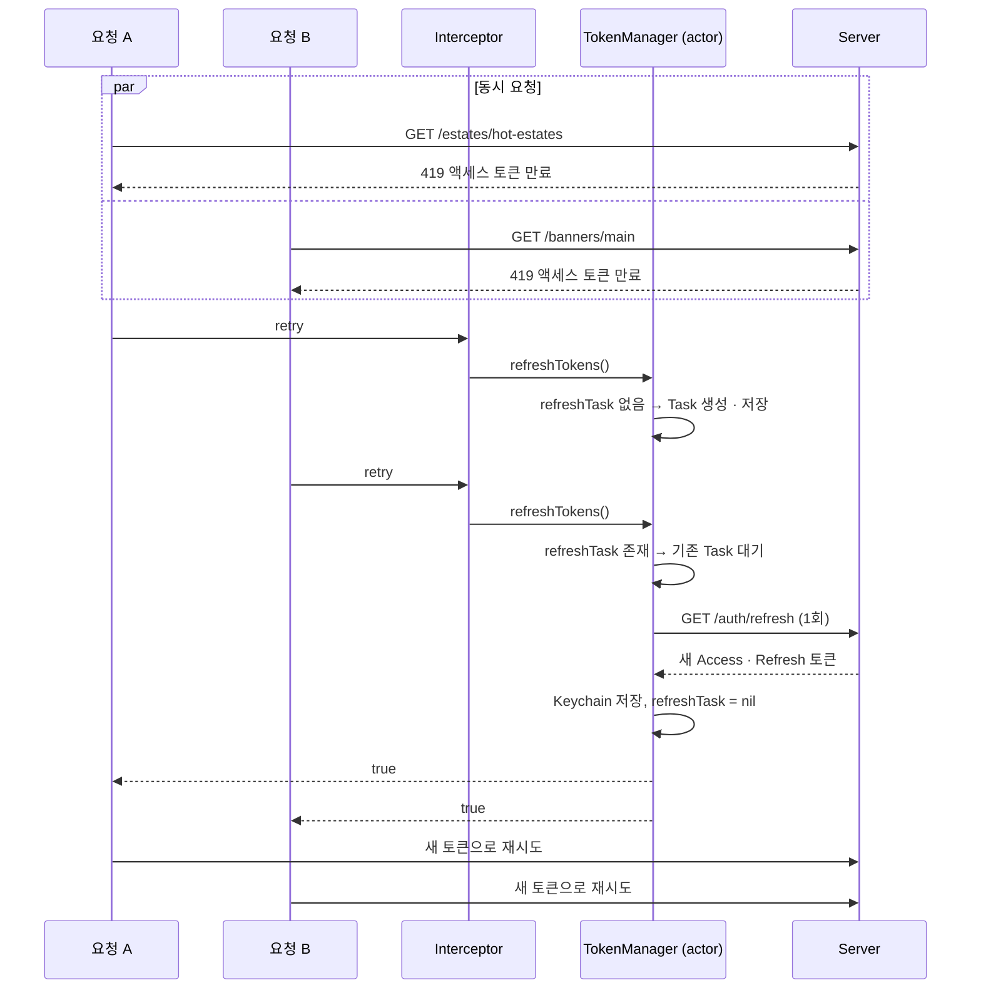

#### 2-4. 세션 만료 전역 처리

- 리프레시 토큰 만료(418) · 로그아웃 → `AuthEventManager`(actor)가 `AsyncStream`으로 `sessionExpired` 방출
- `AppRouter`가 `for await`로 구독 → 화면 단위가 아닌 앱 전역 1곳에서 처리
- 재로그인 후 이전 세션의 네비게이션 스택 · 모달 잔존 방지

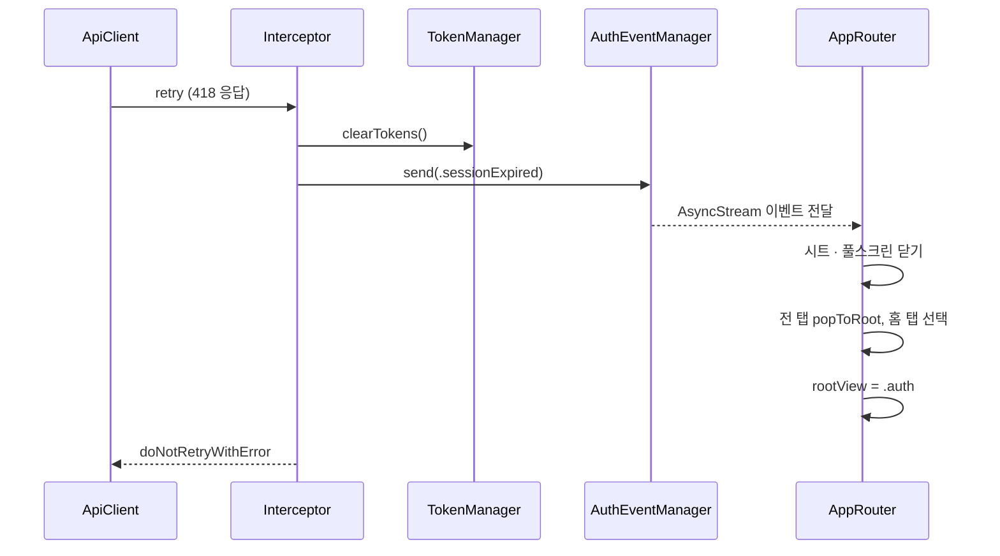

<br>

### 3. 실시간 1:1 채팅

- 친구 목록에서 상대 선택 → `POST /chats` (기존 방 조회 또는 신규 생성) → 채팅방 진입 ([1-3](#1-3-모달-dismiss-후-push-채팅방-진입) 참고)
- 로컬 우선 표시 + 커서 기반 증분 동기화 + 소켓 실시간 수신 조합

#### 3-1. 채팅방 진입 · 동기화

- ① Realm 저장 메시지 즉시 State 반영 → 네트워크 응답 대기 없이 화면 구성
- ② 로컬 마지막 `createdAt`을 커서(`next`)로 전달 → 이후 메시지만 요청
- ③ 신규 메시지 Realm upsert (`chatId` Primary Key) → 정렬된 로컬 결과 재조회 후 반영
- ④ 동기화 완료 후 소켓 연결 (namespace `/chats-{roomId}`)
- 재진입 시 조회 대상이 신규 메시지로 한정 → 대화 길이에 비례한 요청량 증가 없음

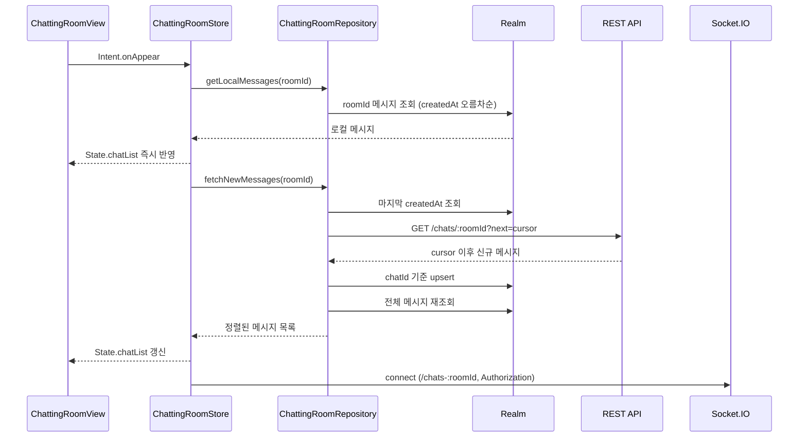

```swift
let cursor = await localDataSource.getLastMessageTimestamp(roomId: roomId)
let endPoint = ApiEndpoint.getMessage(roomId: roomId, next: cursor)
let res = try await apiClient.request(endPoint, type: ChatListResponseDTO.self)

await localDataSource.saveMessages(res.data.map { $0.toEntity() })  // chatId 기준 upsert
return await localDataSource.getMessages(roomId: roomId)
```

#### 3-2. 메시지 송수신 · 중복 방지

- 송신: 입력창 즉시 초기화 → `POST /chats/{roomId}` → 응답 메시지 Realm 저장 → 목록 반영
- 수신: 소켓 `chat` 이벤트 → DTO 디코딩 → Entity 변환 → Combine으로 Store 전달 → Realm 저장 → 목록 반영
- 내가 보낸 메시지는 REST 응답 · 소켓 수신 두 경로로 도착 → `chatId` 존재 여부로 중복 추가 차단 (도착 순서 무관)
- 전송 실패 시 입력 텍스트 복원 + 에러 SideEffect
- 화면 이탈(`onDisappear`) 시 소켓 해제 · 구독 정리
- Keychain `userId`와 발신자 비교로 말풍선 좌우 구분

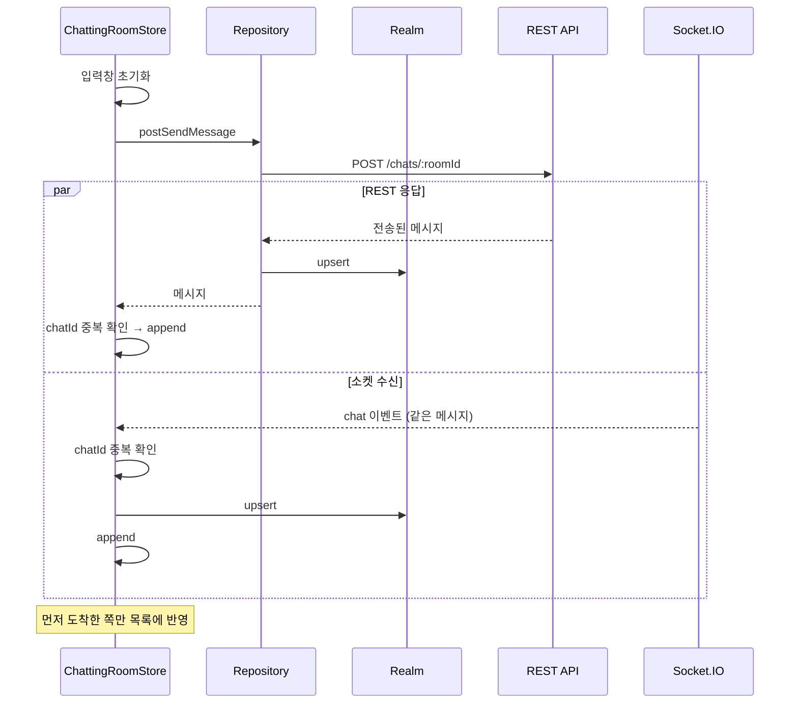

<br>

### 4. Iamport 활용 PG 결제 및 서버 영수증 검증

- **핵심**: 결제창 완료 콜백은 클라이언트 결과 → 예약 확정 근거로 사용하지 않음
  - 서버 영수증 검증 성공 시에만 `isReserved = true`
- **흐름**
  - ① 매물 상세 진입 시 예약금으로 주문 정보 구성
  - ② 예약하기 → `POST /orders` → 서버가 `order_code` 발급
  - ③ `SideEffect.showPayment` → AppRouter가 결제 화면 fullScreen 표시
  - ④ Iamport SDK로 PG 결제 요청 (`merchant_uid` = `order_code`, KG이니시스 테스트 · 카드)
  - ⑤ 결제 콜백 → AppRouter가 `imp_uid` 보관 후 결제 화면 닫기
  - ⑥ 매물 상세가 `imp_uid` 변화 감지 → `Intent.verifyPayment` → `POST /payments/validation`
  - ⑦ 검증 성공 → 예약 완료 상태 전환 / 실패 → `showPaymentFailure`
- 결제 화면: `UIViewControllerRepresentable`로 WKWebView 기반 Iamport 결제 웹뷰 래핑
  - 웹뷰 로딩 완료 전까지 로딩 인디케이터 표시 (KVO `isLoading`)
- 결제 화면은 앱 전역(`MainTabView`) fullScreen → 결과를 AppRouter 상태로 전달해 호출 화면과 분리

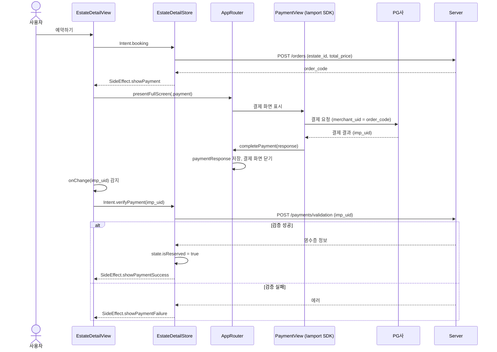

```swift
private func verifyReceipt(impUid: String) {
    Task {
        do {
            _ = try await repository.postValidationReceipt(impUid: ValidationPayDTO(imp_uid: impUid))
            state.isReserved = true                    // 서버 검증 성공 후에만 상태 전이
            effectSubject.send(.showPaymentSuccess)
        } catch {
            effectSubject.send(.showPaymentFailure(error.localizedDescription))
        }
    }
}
```

<br>

### 5. 웹뷰 기반 출석 체크 기능

- 홈 배너 payload `type == "WEBVIEW"` → 웹 URL 생성 → `SideEffect.routeTo(.webView)` → HomeRouter fullScreen으로 표시
- `WKScriptMessageHandler` 기반 웹 ↔ 앱 양방향 통신
  - 웹 → 앱: `click_attendance_button`, `complete_attendance` 메시지 수신
  - 앱 → 웹: `evaluateJavaScript("requestAttendance('token')")`로 AccessToken 전달
- 토큰을 URL · 쿼리에 노출하지 않고, 웹이 요청한 시점에만 JS 함수 인자로 전달
- 메시지 이름 ↔ JS 호출을 `WebMessageName` enum 한 곳에서 관리, 미정의 메시지는 무시
- `dismantleUIView`에서 `removeScriptMessageHandler` → `WKUserContentController`의 핸들러 강한 참조로 인한 메모리 누수 방지
- 출석 완료 횟수 수신 → MainActor에서 콜백 → 알림 표시 후 웹뷰 닫기

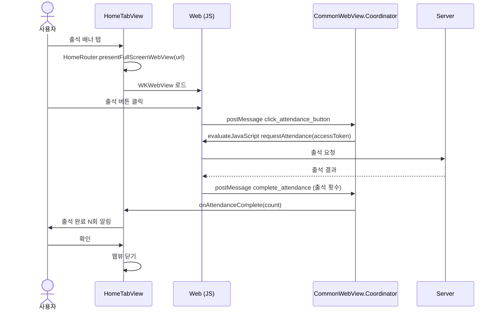

```swift
enum WebMessageName: String, CaseIterable {
    case clickAttendance = "click_attendance_button"
    case completeAttendance = "complete_attendance"

    func js(with token: String) -> String? {
        switch self {
        case .clickAttendance:    return "requestAttendance('\(token)')"
        case .completeAttendance: return nil
        }
    }
}
```
