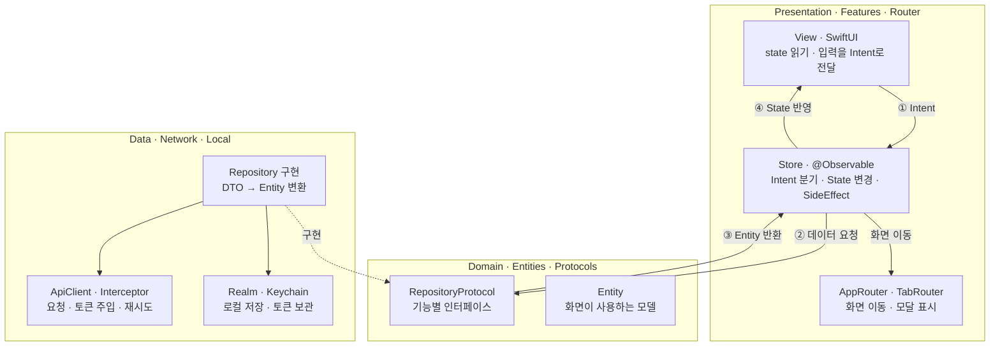
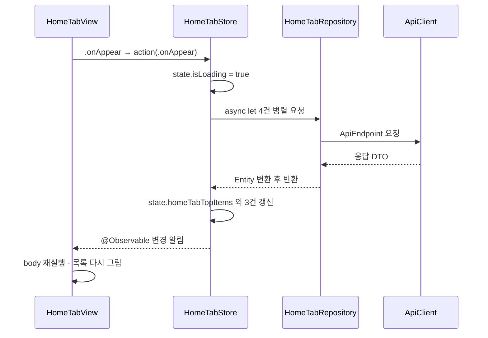
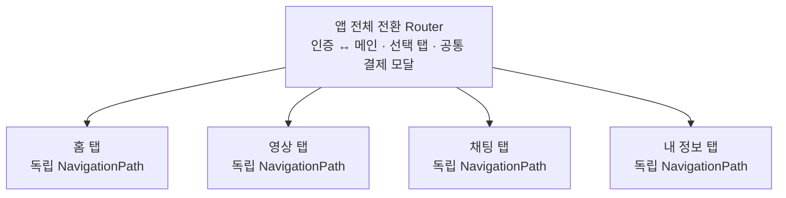
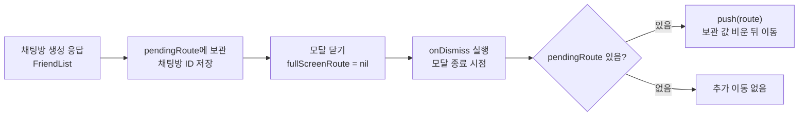
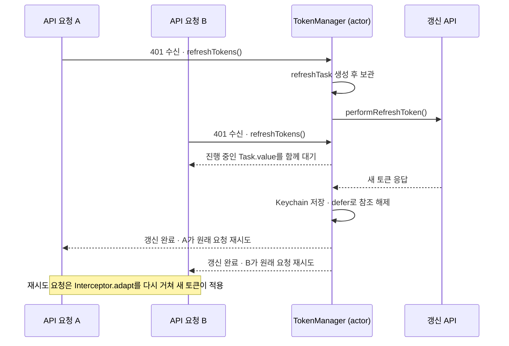
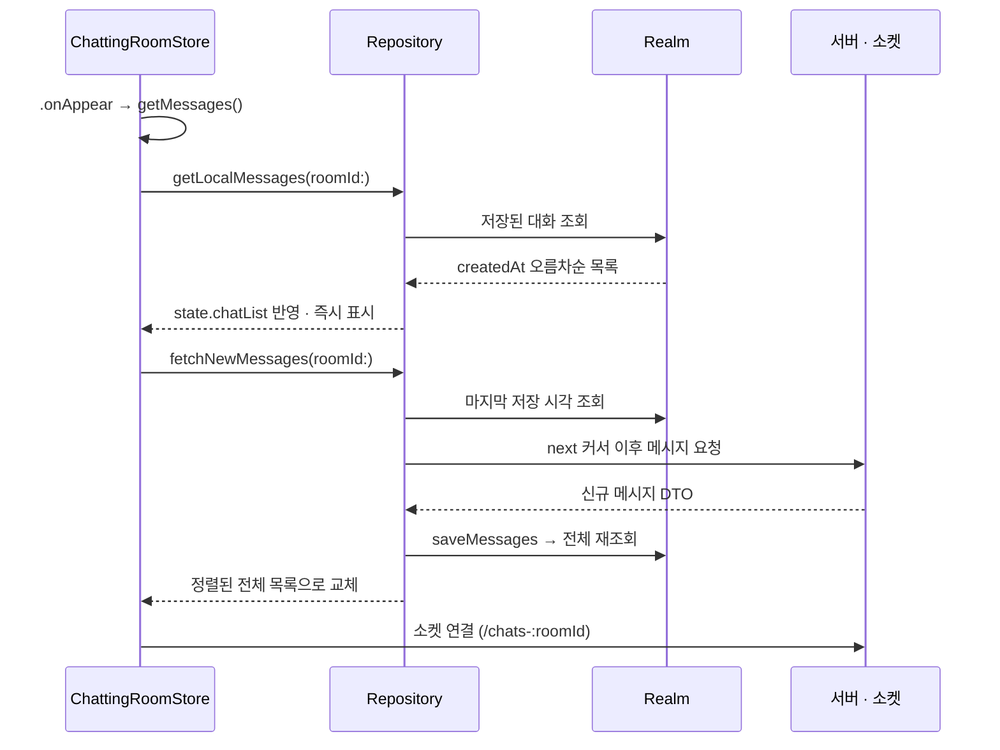
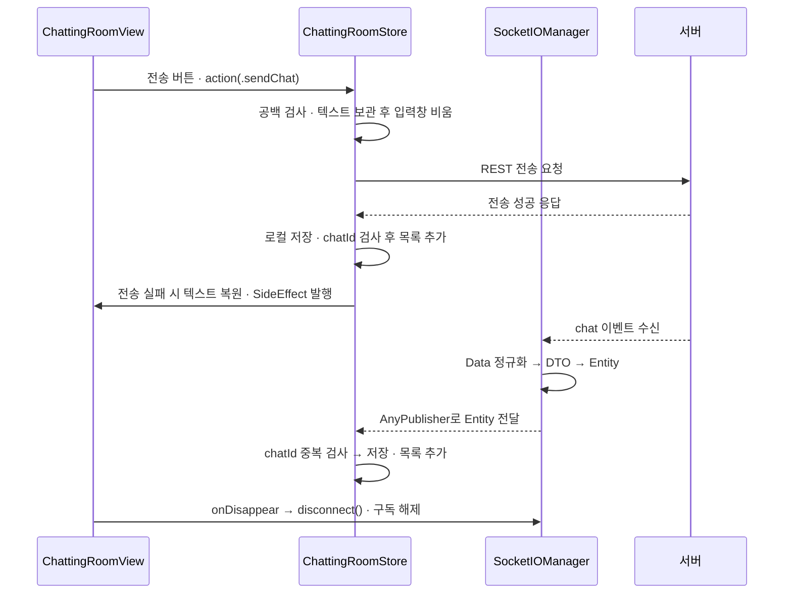
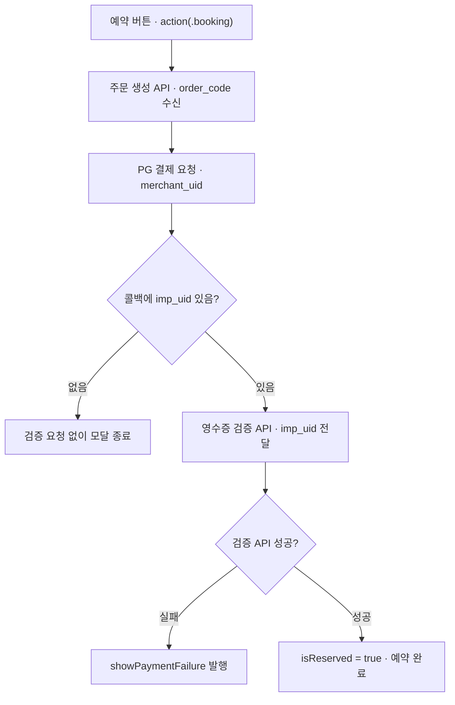
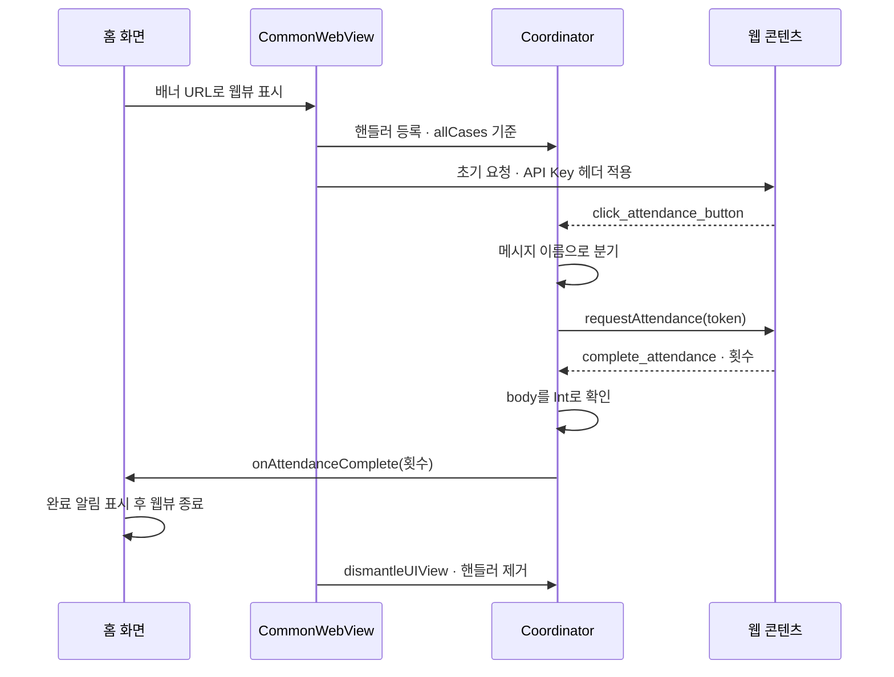
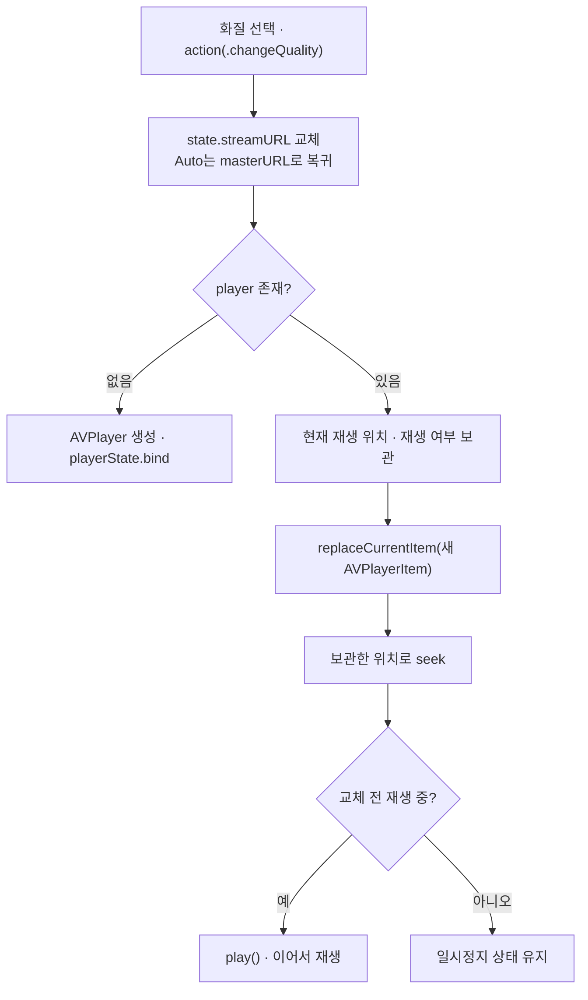

# FlowLab

> 인증, 결제, 실시간 채팅 등 핵심 기능 흐름을 설계하고 구현한 토이 프로젝트

부동산 매물 예약금 결제 · 실시간 1:1 채팅 · 영상 스트리밍을 **MVI 단방향 상태 흐름**으로 구현했습니다.
사용자 입력, 서버 응답, 결제 SDK 콜백, 소켓 수신이 한 화면의 상태를 동시에 바꾸는 상황에서,
상태 변경 진입점을 `Intent` 하나로 모아 화면 값이 어디서 바뀌었는지 추적 가능한 구조를 목표로 했습니다.

| 항목 | 내용 |
| --- | --- |
| 개발 기간 | 2025.12.15 ~ 2026.02.07 (약 8주) |
| 개발 인원 | 1인 (기획 · iOS 개발) |
| 최소 지원 버전 | iOS 17.0 (iPhone) |
| 개발 환경 | Xcode 26.1 · Swift 5 · Swift Package Manager |

### 기술 구성

| 분류 | 기술 |
| --- | --- |
| 아키텍처 | SwiftUI · Observation(`@Observable`) · MVI · Repository · DIContainer |
| 인증 · 동시성 | Keychain · Interceptor · Swift Concurrency(`async/await`, `actor`, `AsyncStream`) |
| 실시간 1:1 채팅 | Socket.IO · Realm · 커서 기반 증분 조회 · `chatId` 기준 중복 방지 |
| 결제 및 영수증 검증 | iamport-ios 1.4.7 (KG이니시스 테스트 PG) · 서버 영수증 검증 API |
| 웹뷰 연동 | WKWebView · JavaScript Bridge · `WKScriptMessageHandler` |
| 미디어 | AVFoundation · `AVPlayerLayer` 커스텀 플레이어 · HLS 화질 전환 |
| 기타 | Kingfisher 8.6.2 · Firebase Cloud Messaging 12.6.0 |

## 주요 기능

### 인증

- 이메일 · 비밀번호 회원가입 / 로그인, 로그인 요청에 FCM 디바이스 토큰 동봉
- Access · Refresh 토큰과 `userId`를 Keychain에 저장, 앱 실행 시 갱신 결과로 루트 화면(인증 ↔ 메인) 결정
- `Interceptor`가 인증이 필요한 요청에만 토큰을 주입하고, 만료 응답은 갱신 후 재시도

### 홈 · 매물 예약

- 화면 진입 Intent 하나로 배너 · 상단 목록 · 인기 매물 · 오늘의 토픽 4개 API를 병렬 요청
- 매물 상세에서 예약금 결제 진행, 서버 영수증 검증이 성공한 시점에만 예약 완료로 반영
- 배너 종류가 웹뷰인 경우 출석 체크 웹 콘텐츠를 전체 화면으로 표시

### 실시간 채팅

- 친구 목록에서 상대 선택 → 채팅방 조회 · 생성 → 채팅방 진입
- Realm에 저장된 대화를 먼저 그리고, 마지막 저장 시각 이후 메시지만 서버에서 보충
- 전송은 REST, 수신은 Socket.IO로 나누고 두 경로 모두 `chatId`로 중복을 확인한 뒤 목록에 추가

### 비디오

- 영상 목록 → 상세 진입 후 HLS 스트림 재생
- `AVPlayerLayer` 기반 커스텀 컨트롤 — 재생 · 탐색 · 좌우 더블탭 10초 이동 · 컨트롤 자동 숨김
- 화질 전환 시 재생 위치와 재생 상태를 유지, 전체 화면은 같은 플레이어를 공유해 가로 전환

### 내 정보

- 로그아웃 시 토큰 삭제 후 세션 만료 이벤트로 앱 전역 화면 스택 초기화

## 아키텍처

### MVI · UseCase 없는 클린 아키텍처

화면의 모든 입력은 `Intent`로 모아 `Store`에 전달하고, Store는 응답을 `State`로 바꿔 View에 반영합니다.
Presentation은 Domain의 Protocol에만 의존하고 구현체는 Data에 두어 통신 방식을 분리했습니다.



**UseCase 계층을 두지 않은 이유**

- 화면별 로직이 *Repository 호출 → State 매핑* 수준이라, UseCase를 두면 위임만 하는 타입이 화면 수만큼 늘어남
- 대신 Domain에는 `Entity`와 `RepositoryProtocol`만 남기고, 분기·매핑·에러 처리는 Store가 담당
- Store가 Protocol에만 의존하는 구조는 유지해, 구현체 교체 지점(`DIContainer`)은 그대로 둠

### 디렉토리 구조

```
FlowLab
├── App                      # 진입점 · AppDelegate · DIContainer
│   ├── DI                   # DIContainer, DIProtocol
│   └── Secret               # AppConfig (baseURL · API Key)
├── Domain                   # 화면이 의존하는 계약
│   ├── Entities             # ChatResponseEntity, EstateDetailEntity ...
│   └── Interfaces
│       ├── Protocols        # 기능별 RepositoryProtocol, ChatLocalDataSourceProtocol
│       └── Services         # TokenManagerProtocol, KeychainProtocol
├── Data                     # 계약의 구현
│   ├── Network              # ApiClient, ApiEndpoint, Interceptor, NetworkError
│   ├── Repositories         # 기능별 Repository (DTO → Entity 변환)
│   ├── DTOs                 # 서버 응답 모델
│   ├── Local                # ChatLocalDataSource, Realm Object
│   ├── Managers             # TokenManager, SocketIOManager, AuthEventManager
│   └── Services             # KeychainService
├── Presentation
│   ├── Features             # 화면 단위 View + Store (HomeTab, ChattingRoom ...)
│   ├── Router               # AppRouter, TabRouters, RouterProtocol
│   └── Common               # StoreProtocol, 비디오 플레이어 · 오버레이
├── Extensions
└── Resources                # Assets, Fonts, Info.plist
```

- `Features` 하위는 화면 하나당 `~View.swift` + `~Store.swift` 한 쌍으로 고정
- 화면이 늘어나도 `Domain/Interfaces/Protocols` → `Data/Repositories` → `Presentation/Features`만 추가

### 핵심 아키텍처 패턴

#### 1. StoreProtocol · 단방향 데이터 흐름

모든 화면 Store가 같은 인터페이스를 채택해 입력 · 상태 · 이벤트의 위치를 통일했습니다.

```swift
protocol StoreProtocol {
    associatedtype State
    associatedtype Intent
    associatedtype SideEffect

    var state: State { get }
    var effect: AnyPublisher<SideEffect, Never> { get }
    func action(_ intent: Intent)
}
```

| 구성 요소 | 책임 |
| --- | --- |
| `State` | 화면이 그리는 지속 값 (로딩 · 목록 · 예약 여부 등), `private(set)`으로 외부 변경 차단 |
| `Intent` | 화면이 보낼 수 있는 행동 단위, `action(_:)`의 `switch`가 처리 함수로 분기 |
| `SideEffect` | 알림 · 결제창 표시 · 화면 이동 등 1회성 이벤트, `PassthroughSubject`로 방출 |
| `Store` | `@MainActor @Observable final class`. Task에서 Repository를 호출해 State에 반영 |

- SideEffect는 State에 남기지 않아 화면 재구성 시 중복 실행이 발생하지 않음
- Store는 URL · 저장 방식을 모르고 Repository Protocol만 호출

**화면 진입 Intent 처리 순서 · 홈 탭**



```swift
private func fetchHomeTabData() {
    Task {
        state.isLoading = true
        defer { state.isLoading = false }        // 어느 경로로 끝나도 해제
        do {
            async let topItems    = repository.fetchHomeTabTopItems()
            async let hotItems    = repository.fetchHotProperties()
            async let dailyTopics = repository.fetchDailyRealEstateTopics()
            async let banners     = repository.fetchBannerMain()
            let (top, hot, daily, banner) = try await (topItems, hotItems, dailyTopics, banners)
            state.homeTabTopItems = top.map { HomeTabTopViewDataItem(entity: $0) }
        } catch { effectSubject.send(.showErrorAlert("...")) }
    }
}
```

- View는 `@Observable` Store를 `@State`로 보유하고 필요한 값만 읽어, 읽은 값이 바뀐 화면만 다시 그려짐
- Store에 `@MainActor`를 적용해 사용자 입력과 API 응답의 상태 변경을 한 실행 영역에서 처리
- 검색어 입력은 `state.searchInput`만 바꿔 즉시 반영, 화면 진입은 Task에서 네 요청을 보낸 뒤 갱신

#### 2. Router · 앱 전체 전환과 탭 탐색 기록의 분리



- 인증 · 메인 전환과 공통 결제 모달은 `AppRouter`, 탭 내부 이동 기록은 탭별 Router가 보관
- `push` · `pop` · `popToRoot`는 `RouterProtocol` 기본 구현으로 제공해 탭 스택이 서로 영향을 주지 않음
- 목적지는 `Hashable enum` + 연관값으로 표현해 상세 ID · 채팅방 ID를 이동 요청에 함께 전달
- `ViewBuildable`이 경로를 View로 바꾸고, `DIContainer`가 *Repository → Store → View*를 조립

**모달 종료 이후의 이동 처리 경로**



```swift
func dismissFullScreenAndNavigate(to route: ChattingTabRoute) {
    pendingRoute = route     // 다음 목적지를 보관
    fullScreenRoute = nil    // 모달 먼저 닫기
}

func handlePendingNavigation() {         // fullScreenCover의 onDismiss에서 호출
    guard let route = pendingRoute else { return }
    pendingRoute = nil
    push(route)
}
```

- 모달이 닫힌 뒤에 이동하도록 순서를 고정해, 모달이 닫히는 도중 push가 실행돼 이동이 누락되는 경우를 막음

#### 3. DIContainer · 의존성 조립

- `DIContainer`가 `KeychainService` → `TokenManager` → `Interceptor` → `ApiClient` 순으로 한 번만 조립
- 토큰 갱신 전용 `ApiClient`는 Interceptor를 적용하지 않아, 갱신 요청이 다시 갱신을 유발하는 순환을 차단
- Repository · Store · Router 생성은 모두 `DIContainer` 팩토리 메서드를 경유

## 핵심 구현

### 1. 동시 요청 중 토큰 만료 처리

여러 API가 동시에 만료 응답을 받으면 갱신 요청이 중복될 수 있습니다.
`TokenManager` actor에 진행 중인 갱신 Task를 보관해 갱신은 한 번만 실행하고,
토큰 저장이 끝난 뒤 각 요청이 자신의 요청을 재시도하도록 구현했습니다.



```swift
func refreshTokens() async throws -> Bool {
    if let existingTask = refreshTask {
        return try await existingTask.value
    }

    let task = Task<Bool, Error> {
        defer { self.refreshTask = nil }
        return try await performRefreshToken()
    }

    self.refreshTask = task
    return try await task.value
}
```

- 홈 탭은 API 4개를 `async let`으로 동시 호출 → 만료 시 요청마다 개별 갱신을 시도할 수 있는 조건
- Task 확인 ~ 저장 사이에 `await`가 없어, actor 재진입 상황에서도 Task가 중복 생성되지 않음
- `Interceptor.adapt`가 `Endpoint.requiresAuth`를 확인해 필요한 요청에만 Access Token을 주입
- 재실행은 `ApiClient`가 맡아 `retryCount`로 최대 2회까지 제한, 재실행 시 `adapt`를 다시 거쳐 새 토큰 적용
- 418(리프레시 토큰 만료)은 토큰을 삭제하고 `AuthEventManager`가 `AsyncStream`으로 `sessionExpired`를 방출,
  `AppRouter`가 구독해 모달 종료 · 전 탭 `popToRoot` · 인증 화면 복귀를 앱 전역 한 곳에서 처리

### 2. 실시간 1:1 채팅

#### 2-1. 채팅방 진입 시 대화 이력 동기화

대화는 계속 쌓이고, 앱이 꺼져 있는 사이에 온 메시지는 소켓으로 받을 수 없습니다.
이미 받은 대화는 로컬에서 읽고, 마지막 저장 시각 이후의 메시지만 서버에서 보충하도록 나눴습니다.



```swift
func fetchNewMessages(roomId: String) async throws -> [ChatResponseEntity] {
    let cursor = await localDataSource.getLastMessageTimestamp(roomId: roomId)
    let endPoint = ApiEndpoint.getMessage(roomId: roomId, next: cursor)
    let res = try await apiClient.request(endPoint, type: ChatListResponseDTO.self)
    let newMessages = res.data.map { $0.toEntity() }
    if !newMessages.isEmpty { await localDataSource.saveMessages(newMessages) }
    return await localDataSource.getMessages(roomId: roomId)
}
```

- 진입할 때마다 전체 이력을 내려받으면 요청 · 응답 크기가 함께 커지므로, 받은 대화는 Realm에서 읽고 새 메시지만 요청
- 네트워크가 끊겼거나 조회에 실패해도 저장된 대화는 그대로 표시 → 재진입 시 빈 화면을 거치지 않음
- 소켓은 연결된 동안 도착한 메시지만 전달하므로, 마지막 메시지의 `createdAt`을 커서로 보내 그 이후만 조회
- 내려받은 메시지는 `chatId`를 Primary Key로 저장해 같은 메시지가 중복으로 쌓이지 않음

#### 2-2. 메시지 송수신과 소켓 연결 관리

전송은 실패했을 때 다시 보낼 수 있어야 하고, 수신은 상대가 보낸 즉시 화면에 나타나야 합니다.
두 요구가 달라 보내는 쪽은 REST, 받는 쪽은 Socket.IO로 나눴습니다.



```swift
private func handleSocketMessage(_ message: ChatResponseEntity) async {
    guard !state.chatList.contains(where: { $0.chatId == message.chatId }) else { return }
    await localDataSource.saveMessage(message)
    state.chatList.append(message)
}
```

- REST는 응답으로 결과가 바로 오므로, 실패 시 입력 텍스트를 되돌리고 다시 보내는 처리를 앱에서 직접 제어
- 소켓 전송은 결과를 별도 이벤트로 맞춰야 하고 끊긴 구간의 재전송까지 직접 관리해야 해, 실시간 수신에만 사용
- 내가 보낸 메시지는 REST 응답과 소켓 이벤트로 두 번 들어올 수 있어, 두 경로 모두 `chatId` 확인 후 추가 (도착 순서 무관)
- 연결 · 인증 · 파싱은 소켓 관리 객체에 모으고 Store에는 Entity만 전달, 화면을 벗어나면 연결 해제 · 구독 정리

### 3. 결제 및 서버 영수증 검증

PG 결제가 끝났다는 콜백만으로는 예약을 확정할 수 없습니다.
*서버 주문 생성 → PG 결제 → 영수증 검증*으로 나누고, 검증 API가 성공한 시점에만 예약 완료로 반영했습니다.



```swift
private func verifyReceipt(impUid: String) {
    Task {
        do {
            _ = try await repository.postValidationReceipt(impUid: ValidationPayDTO(imp_uid: impUid))
            state.isReserved = true
            effectSubject.send(.showPaymentSuccess)
        } catch { effectSubject.send(.showPaymentFailure(...)) }
    }
}
```

- PG 콜백은 결제 요청이 어떻게 끝났는지만 알려줌 — 잔액 부족 · 유효기간 만료 · 승인 실패를 앱이 콜백만으로 확정하기 어려움
- 품절 · 매진 · 상품 삭제처럼 결제 전후로 바뀌는 상태는 클라이언트가 알 수 없어, 결제 직후 영수증 검증 API 응답을 기준으로 사용
- 상세 API의 ID · 예약 금액으로 주문을 생성하고, 응답의 `order_code`를 `merchant_uid`로 전달해 서버 주문과 PG 요청을 연결
- 결제 화면은 `UIViewControllerRepresentable`로 Iamport 결제 웹뷰를 래핑하고, 앱 전역 fullScreen으로 표시해 호출 화면과 분리

### 4. 웹뷰 연동

배너 데이터로 `WKWebView`를 열고 JavaScript Bridge로 출석 요청과 결과를 교환했습니다.
웹의 출석 버튼을 앱의 인증 정보 전달과 연결하고, 완료 횟수는 앱 알림으로 표시했습니다.



```swift
func userContentController(_ c: WKUserContentController, didReceive message: WKScriptMessage) {
    guard let type = WebMessageName(rawValue: message.name) else { return }
    switch type {
    case .clickAttendance:
        webView?.evaluateJavaScript("requestAttendance('\(parent.accessToken)')")
    case .completeAttendance:
        guard let count = message.body as? Int else { return }
        Task { @MainActor in parent.onAttendanceComplete?(count) }
    }
}
```

- 배너 종류가 웹뷰면 payload 경로와 웹 기본 주소를 합쳐 URL을 구성, *SideEffect → View → Router*를 거쳐 전체 화면에 표시
- 토큰을 URL · 쿼리에 노출하지 않고, 웹이 클릭 이벤트를 보낸 시점에만 JS 함수 인자로 전달
- 메시지 이름 ↔ JS 호출을 `WebMessageName` enum 한 곳에서 관리하고, 정의되지 않은 메시지와 잘못된 본문은 처리하지 않음
- `updateUIView`는 `uiView.url != url`일 때만 재로드, `dismantleUIView`에서 핸들러를 제거해
  `WKUserContentController`의 강한 참조로 인한 메모리 누수를 방지 (Coordinator는 웹뷰를 `weak` 참조)
- 홈에서 조회한 토큰을 전달하며, 출석 요청 중의 토큰 갱신은 구현하지 않았습니다

### 5. 비디오 플레이어

`AVKit`의 기본 컨트롤 대신 `AVPlayerLayer`를 직접 감싸, 화질 전환과 전체 화면에서도
같은 플레이어 인스턴스와 재생 상태를 유지하도록 구성했습니다.



```swift
private func updatePlayerURL(_ url: URL?) {
    guard let url = url else { return }

    let currentTime: CMTime = player?.currentTime() ?? .zero   // 교체 전 위치 보관
    let isPlaying = player?.rate != 0
    let newItem = AVPlayerItem(url: url)

    if player == nil {
        let newPlayer = AVPlayer(playerItem: newItem)
        player = newPlayer
        playerState.bind(player: newPlayer)
        newPlayer.play()
    } else {
        player?.replaceCurrentItem(with: newItem)
        player?.seek(to: currentTime, toleranceBefore: .zero, toleranceAfter: .zero) { _ in
            if isPlaying { player?.play() }
        }
    }
}
```

- **화면 구성**: `VideoPlayerView`(`UIViewRepresentable` + `layerClass`를 `AVPlayerLayer`로 재정의) 위에
  `VideoControllerOverlay`를 얹어 컨트롤을 직접 구현
- **재생 상태 분리**: `VideoPlayerState`(`@Observable`)가 재생 여부 · 현재 시각 · 길이 · 컨트롤 표시 여부를 보관.
  `addPeriodicTimeObserver`(0.5초)로 시각을 갱신하고, `bind`/`unbind`로 옵저버를 한 번만 등록·해제
- **화질 전환**: Store는 URL만 바꾸고, View가 `onChange(of: streamURL)`에서 아이템을 교체 →
  재생 위치와 재생 여부를 유지한 채 전환 (`Auto`는 HLS master URL로 복귀)
- **전체 화면**: `fullScreenCover`에 같은 `AVPlayer`와 `VideoPlayerState`를 전달해 재버퍼링 없이 이어서 재생.
  `requestGeometryUpdate`로 가로 전환하고, `OrientationLock` 플래그로 해당 화면에서만 가로를 허용
- **조작**: 좌 · 우 더블탭 10초 이동, 싱글탭 컨트롤 토글, 3초 후 자동 숨김(`Task` 취소로 타이머 관리)
- 화면 이탈 시 `pause()` · `unbind()`로 플레이어와 옵저버 정리
